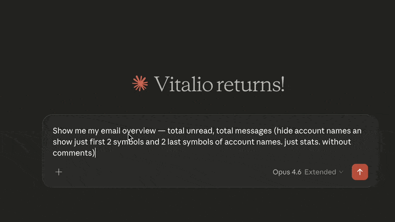
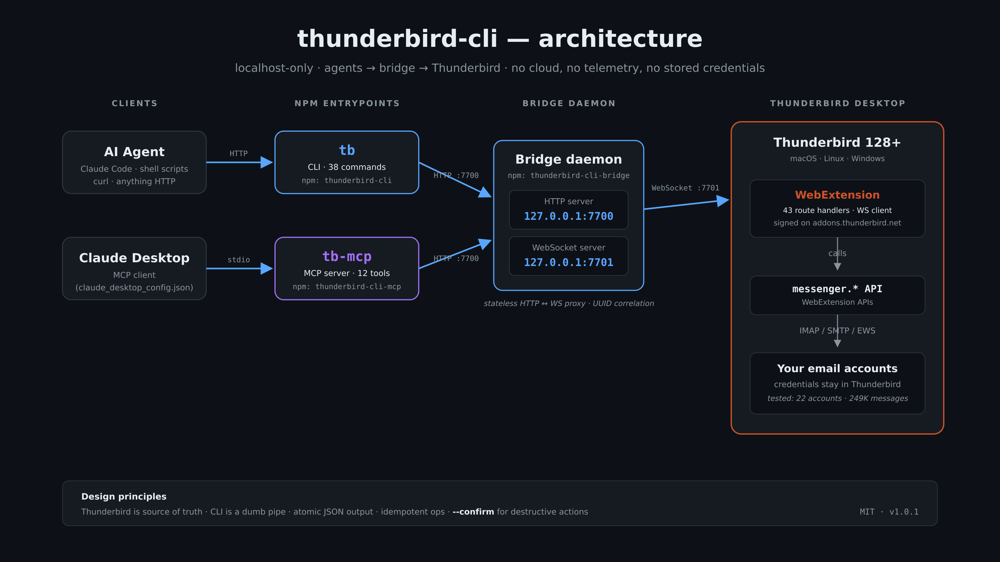

# thunderbird-cli

> Give Claude (and other AI agents) full access to your email through Mozilla Thunderbird.

[](https://github.com/vitalio-sh/thunderbird-cli/actions/workflows/test.yml)
[](https://opensource.org/licenses/MIT)
[](https://nodejs.org)
[](https://www.thunderbird.net)
[](https://modelcontextprotocol.io)

<p align="center">
  
</p>

## Why

IMAP libraries force you to manage credentials, OAuth flows, and sync state — dangerous in an AI-agent context. **Thunderbird already solves all of that.** This tool treats Thunderbird as the source of truth and exposes every capability as a CLI command or MCP tool, so AI agents can read, search, and write email without ever touching a password.

Tested at scale: **22 accounts, 249,000+ messages, 86,000+ unread** — all managed live through a single CLI.

## Features

- 🔐 **Zero credential exposure** — all IMAP/SMTP stays in Thunderbird
- 🤖 **Claude Desktop ready** — 12 MCP tools, one-line config
- 📨 **38 CLI commands** — read, search, compose, reply, bulk ops, folder CRUD, attachments
- 🛡️ **Safe by default** — compose/reply/forward save as drafts; permanent delete requires `--confirm`
- 🎯 **Token-optimized** — `--fields` selection, `--compact` mode, `--max-body` truncation
- 🏠 **Localhost-only** — no cloud, no telemetry, nothing leaves your machine
- ✅ **Thunderbird 128+** — signed and approved on addons.thunderbird.net
- 🧪 **80 tests** — 46 CLI/bridge + 34 MCP integration tests

## Quick Start

```bash
# 1. Install CLI + bridge from npm
npm install -g thunderbird-cli thunderbird-cli-bridge

# 2. Install the signed Thunderbird extension
#    Download: https://github.com/vitalio-sh/thunderbird-cli/releases/latest
#    Thunderbird → Add-ons → ⚙ → Install Add-on From File… → thunderbird_ai_bridge-*.xpi

# 3. Start the bridge daemon (keep running)
tb-bridge

# 4. Try it
tb health
tb stats
```

Full setup guide (including background service, Docker, troubleshooting): **[docs/SETUP.md](docs/SETUP.md)**

## Usage

```bash
# How many unread across all accounts?
tb stats

# Find invoices from AWS in the last 30 days
tb search "invoice" --from aws --since 30d --fields id,author,subject,date

# Read a message (token-efficient — headers + text only, max 500 chars)
tb read 89900 --max-body 500

# Reply as draft (never auto-sends)
tb reply 89900 --body "Thanks, I'll review tomorrow"

# Download a PDF attachment
tb attachment-download 11 1.2 --output invoice.pdf

# Bulk archive old newsletters
tb bulk move "account1://INBOX" "account1://Archive" \
  --from "newsletter@" --older-than 30
```

Full command reference: **[docs/COMMANDS.md](docs/COMMANDS.md)**

## Use with Claude Desktop

Add to your Claude Desktop config (`~/Library/Application Support/Claude/claude_desktop_config.json` on macOS):

```json
{
  "mcpServers": {
    "thunderbird": {
      "command": "npx",
      "args": ["-y", "thunderbird-cli-mcp"]
    }
  }
}
```

Restart Claude Desktop. Now ask:

> *"How many unread emails do I have?"*
> *"Find invoices from AWS last month"*
> *"Reply to message 118 saying I'll attend — save as draft"*
> *"Download the PDF attachment from message 245"*

Full MCP guide: **[mcp/README.md](mcp/README.md)**

### Companion skill for Claude

A [Claude Skill](https://agentskills.io) ships alongside the MCP server. It teaches Claude *how to use* the 12 email tools well — token-efficient field selection, draft-by-default safety, trust-metadata checking before acting on links, recipes for common workflows. Install it from **[`skills/thunderbird-cli/`](skills/thunderbird-cli/)**:

```bash
# Claude Code
cp -r skills/thunderbird-cli ~/.claude/skills/

# Claude.ai — zip and upload via Settings → Capabilities → Skills
cd skills && zip -r thunderbird-cli.zip thunderbird-cli
```

Without the skill, the MCP still works. With it, Claude automatically uses the safest defaults and most efficient response shapes.

## How It Works

<p align="center">
  
</p>

| Component | Role |
|---|---|
| **Extension** (`extension/`) | Thunderbird WebExtension. Calls `messenger.*` APIs. 43 route handlers. |
| **Bridge** (`bridge/`) | Stateless HTTP↔WebSocket proxy daemon. No business logic. |
| **CLI** (`cli/`) | `tb` command — 38 commands. Thin HTTP client. JSON output. |
| **MCP** (`mcp/`) | `tb-mcp` server — 12 curated tools for Claude Desktop. |

Thunderbird is the source of truth. The CLI never caches or stores email data.

## How this compares

| Tool | Credentials | AI-agent ready | Compose / send | Multi-account | Runtime |
|---|---|---|---|---|---|
| **thunderbird-cli** | stay in Thunderbird | ✅ CLI + MCP, JSON out | ✅ draft / open / send | ✅ any Thunderbird account | Node.js |
| Raw IMAP libs (imapflow, imaplib) | you manage them | you wire it yourself | SMTP, separate | manual per account | varies |
| [notmuch](https://notmuchmail.org) | via your MUA | CLI only, text output | ❌ reader only | via config | C |
| [mu / mu4e](https://www.djcbsoftware.nl/code/mu/) | via your MUA | CLI only, sexp/text | ❌ reader only | via config | C |
| [himalaya](https://github.com/soywod/himalaya) | in config files | ✅ CLI, JSON out | ✅ | ✅ | Rust |
| [mutt / neomutt](http://www.mutt.org) | in muttrc | ❌ interactive TUI | ✅ | via config | C |

The niche: **you already trust Thunderbird with your credentials and account state.** This tool surfaces that as a machine-readable API without asking you to re-configure IMAP/SMTP anywhere else.

## Documentation

| Doc | What's inside |
|---|---|
| [docs/SETUP.md](docs/SETUP.md) | Installation, background service, Docker, troubleshooting |
| [docs/COMMANDS.md](docs/COMMANDS.md) | Full reference for all 38 CLI commands |
| [docs/CLAUDE.md](docs/CLAUDE.md) | AI-agent-focused quick reference + security rules |
| [skills/thunderbird-cli/SKILL.md](skills/thunderbird-cli/SKILL.md) | **Companion Claude Skill** — recipes, safety defaults, token patterns |
| [mcp/README.md](mcp/README.md) | Claude Desktop integration guide |
| [AGENTS.md](AGENTS.md) | Guide for AI agents editing this codebase |
| [SPEC.md](SPEC.md) | Full technical specification |
| [SECURITY.md](SECURITY.md) | Threat model, prompt-injection defenses |
| [CONTRIBUTING.md](CONTRIBUTING.md) | Dev setup, code style, PR process |
| [CHANGELOG.md](CHANGELOG.md) | Release notes |

## Contributing

Contributions welcome. Please open an issue first to discuss non-trivial changes. See [CONTRIBUTING.md](CONTRIBUTING.md) for local dev setup and the 80-test suite.

## License

MIT — see [LICENSE](LICENSE)
